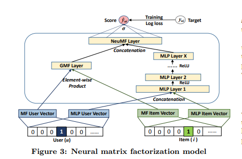

# neural_collaborative_filtering
神经网络协同过滤论文复现 
论文地址 https://www.comp.nus.edu.sg/~xiangnan/papers/ncf.pdf 
数据集在<a>https://github.com/Alean-singleDog/Recommend-system-HomeWork</a>项目里，我就不重复上传了
<h3>摘要</h3>
In recent years, deep neural networks have yielded immense success on speech recognition, computer vision and natural language processing. However, the exploration of deep neural networks on recommender systems has received relatively less scrutiny. In this work, we strive to develop techniques based on neural networks to tackle the key problem in recommendation — collaborative filtering — on the basis of implicit feedback.

 

    &&Although some recent work has employed deep learning for recommendation, they primarily used it to model auxiliary information, such as textual descriptions of items and acoustic features of musics. When it comes to model the key factor in collaborative filtering — the interaction between user and item features, they still resorted to matrix factorization and applied an inner product on the latent features of users and items. 
    
 

    &&By replacing the inner product with a neural architecture that can learn an arbitrary function from data, we present a general framework named NCF, short for Neural networkbased Collaborative Filtering. NCF is generic and can express and generalize matrix factorization under its framework. To supercharge NCF modelling with non-linearities, we propose to leverage a multi-layer perceptron to learn the
user–item interaction function. Extensive experiments on two real-world datasets show significant improvements of our proposed NCF framework over the state-of-the-art methods.
Empirical evidence shows that using deeper layers of neural networks offers better recommendation performance.
<h4>网络架构图</h4>
</img>
